# Make the 3D Scan Face the Camera

This repository provides a solution to align 3D human scans to face the camera with zero azimuth angle, which is particularly useful for processing 3D human scan datasets.

## Overview

### Problem Statement
In 3D human scan datasets, the poses and orientations of human scans are often diverse and not consistently aligned. This misalignment can cause issues in downstream tasks that require standardized orientations.

### Example of Misaligned Scans
Below are sample renders from THuman2.1 dataset showing the orientation issue:
<p float="left">
  
  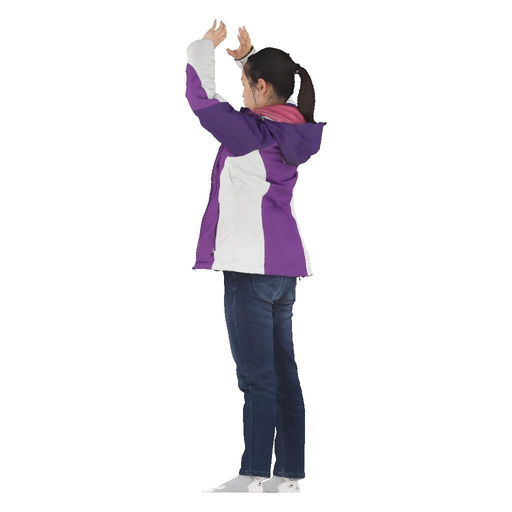 
</p>

### Solution Pipeline
Our method follows these key steps:
1. Generate a render from a zero-azimuth camera perspective
2. Estimate SMPL-X parameters from the rendered image
3. Extract the global orientation parameter
4. Apply rotation transformation to the 3D scan (considering y-axis only)

**Important**: Input scans must have y-axis as up direction:
<p float="left">
  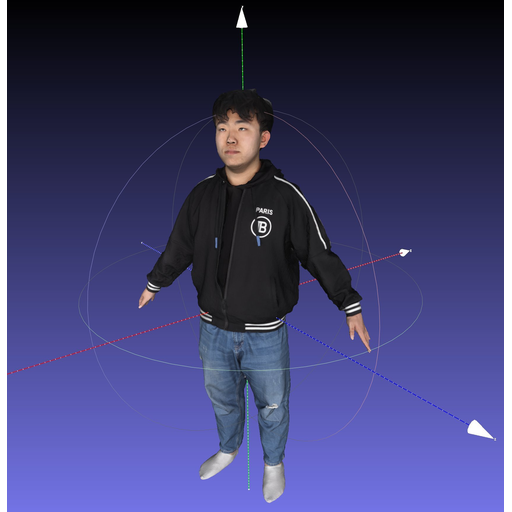
</p>

## Getting Started

### Prerequisites
The code has been tested with PyTorch 2.0.1. You can choose the appropriate CUDA version based on your system:

```bash
# For CUDA 12.1 
pip install torch==2.0.1 torchvision==0.15.2 torchaudio==2.0.2 --index-url https://download.pytorch.org/whl/cu121 

# For CUDA 11.8 
pip install torch==2.0.1 torchvision==0.15.2 torchaudio==2.0.2 --index-url https://download.pytorch.org/whl/cu118 
```

### Installation

1. Install basic requirements:
```bash
pip install -r requirements.txt
```

2. Install PyTorch3D:
```bash
pip install "git+https://github.com/facebookresearch/pytorch3d.git"
```

3. Install MMCV:
```bash
pip install -U openmin
min install "mmcv-full>=1.3.17,<1.6.0" -f https://download.openmmlab.com/mmcv/dist/cu118/torch2.0.1/index.html
```

4. Install MMHuman3D:
```bash
pip install "git+https://github.com/open-mmlab/mmhuman3d.git"
```

### Required Models and Data

1. Register at [ICON's website](https://icon.is.tue.mpg.de/) to access necessary models:


2. Download required data:
```bash
cd ./thirdparties/econ
bash fetch_data.sh
```

The project utilizes models and data from several excellent works:
- [SMPL-X](https://github.com/vchoutas/smplify-x)
- [PIXIE](https://github.com/yfeng95/PIXIE)
- [PyMAF-X](https://github.com/HongwenZhang/PyMAF-X)
- [ECON](https://github.com/YuliangXiu/ECON)

<details><summary>Citations</summary>

```bibtex
@inproceedings{SMPL-X:2019,
  title = {Expressive Body Capture: 3D Hands, Face, and Body from a Single Image},
  author = {Pavlakos, Georgios and Choutas, Vasileios and Ghorbani, Nima and Bolkart, Timo and Osman, Ahmed A. A. and Tzionas, Dimitrios and Black, Michael J.},
  booktitle = {Proceedings IEEE Conf. on Computer Vision and Pattern Recognition (CVPR)},
  year = {2019}
}

@inproceedings{PIXIE:2021,
      title={Collaborative Regression of Expressive Bodies using Moderation}, 
      author={Yao Feng and Vasileios Choutas and Timo Bolkart and Dimitrios Tzionas and Michael J. Black},
      booktitle={International Conference on 3D Vision (3DV)},
      year={2021}
}

@article{pymafx2023,
  title={PyMAF-X: Towards Well-aligned Full-body Model Regression from Monocular Images},
  author={Zhang, Hongwen and Tian, Yating and Zhang, Yuxiang and Li, Mengcheng and An, Liang and Sun, Zhenan and Liu, Yebin},
  journal={IEEE Transactions on Pattern Analysis and Machine Intelligence},
  year={2023}
}

@inproceedings{pymaf2021,
  title={PyMAF: 3D Human Pose and Shape Regression with Pyramidal Mesh Alignment Feedback Loop},
  author={Zhang, Hongwen and Tian, Yating and Zhou, Xinchi and Ouyang, Wanli and Liu, Yebin and Wang, Limin and Sun, Zhenan},
  booktitle={Proceedings of the IEEE International Conference on Computer Vision},
  year={2021}
}

@inproceedings{xiu2023econ,
  title     = {{ECON: Explicit Clothed humans Optimized via Normal integration}},
  author    = {Xiu, Yuliang and Yang, Jinlong and Cao, Xu and Tzionas, Dimitrios and Black, Michael J.},
  booktitle = {Proceedings of the IEEE/CVF Conference on Computer Vision and Pattern Recognition (CVPR)},
  month     = {June},
  year      = {2023},
}
```
</details>

## Usage

1. Configure your parameters in `run.sh`:
   - `MESH_OBJ_PATH`: Path to input mesh
   - `ALBEDO_PATH`: Path to albedo texture
   - `SMPL_OBJ_PATH`: Path to SMPL model
   - `OUTPUT_DIR`: Directory for results

2. Run the alignment process:
```bash
bash run.sh
```

## Results (Before & After Process)

### Human4Dit Dataset Examples
<p float="left">
  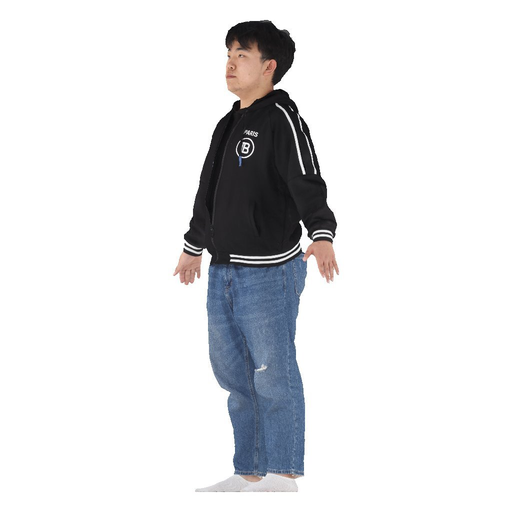
  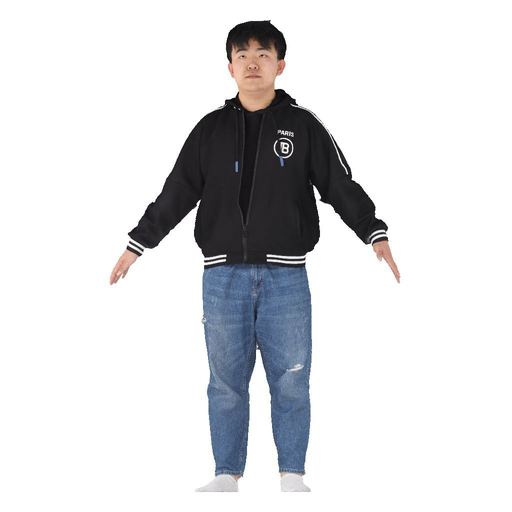 
</p>

### THuman2.1 Dataset Examples
<p float="left">
  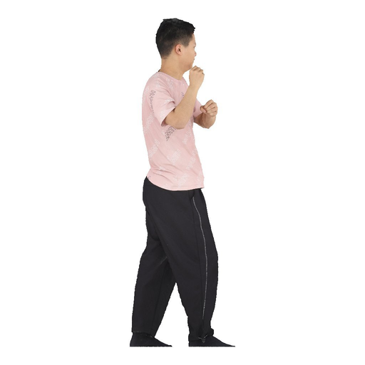
  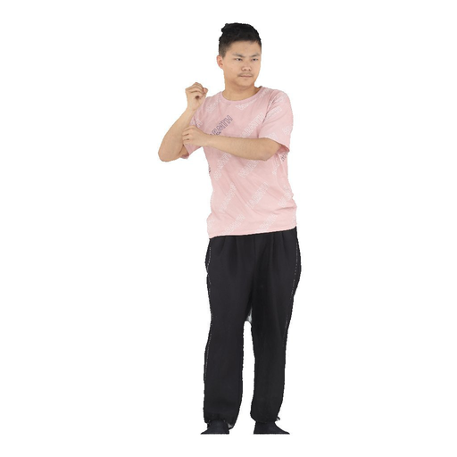 
</p>

### Multi-view Rendering Results
Rendered from multiple viewpoints (azimuth angles: 0°, 45°, 90°, 180°, 270°, 315°):
<p float="left">
  
  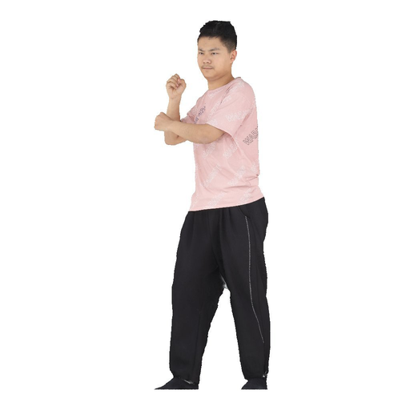 
  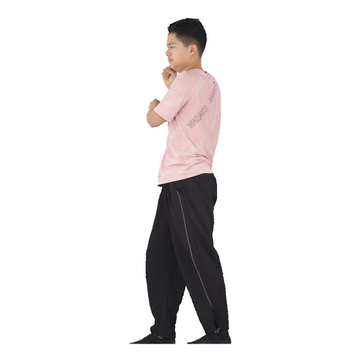
  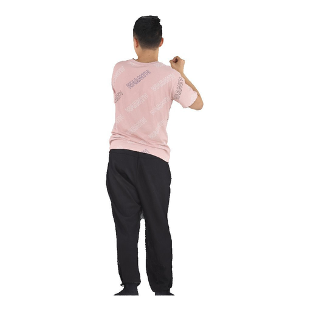
  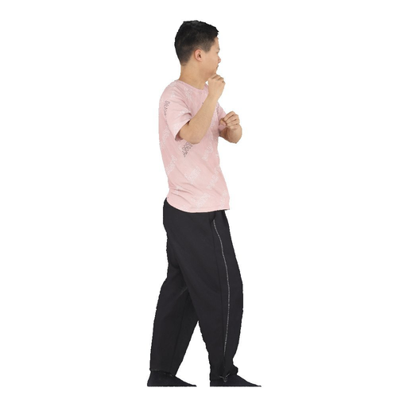
  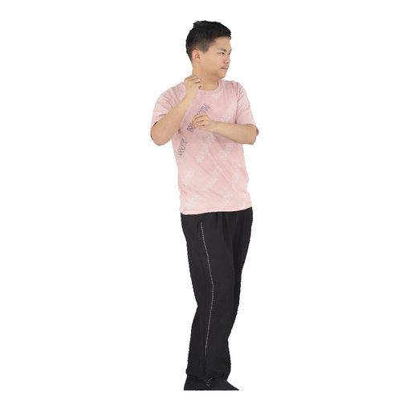
</p>
